# User Flows & System Architecture

This document maps all user actions in the AI Avatar Photo Shoot application, including their internal system architecture (API calls, DB operations, storage interactions). Created to support migration of heavy tasks to trigger.dev.

## Table of Contents

1. [System Overview](#1-system-overview)
2. [Authentication Flows](#2-authentication-flows)
3. [Profile/Settings Flows](#3-profilesettings-flows)
4. [Collection Management Flows](#4-collection-management-flows)
5. [Image Generation Flows](#5-image-generation-flows)
6. [Image Management Flows](#6-image-management-flows)
7. [Video Prompt Flows](#7-video-prompt-flows)
8. [Trigger.dev Migration Notes](#8-triggerdev-migration-notes)

---

## 1. System Overview

### System Context Diagram

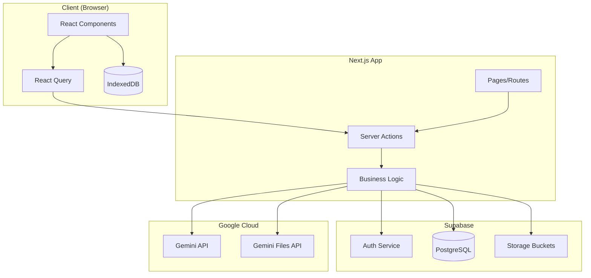

### Database Schema

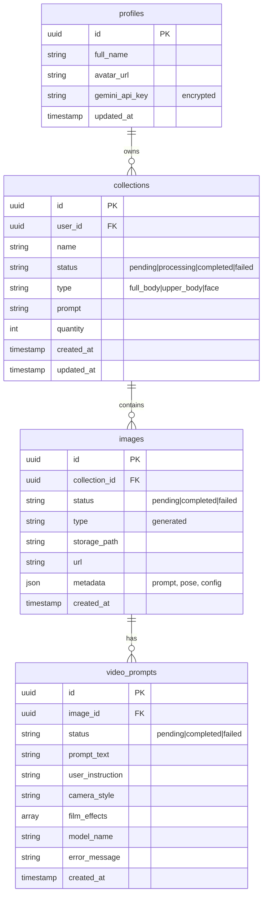

### Action Weight Summary

| Action | Weight | Trigger.dev Candidate | Reason |
|--------|--------|----------------------|--------|
| Login/Logout | Light | No | OAuth redirect only |
| Update API Key | Light | No | Simple DB write |
| Delete API Key | Light | No | Simple DB update |
| Create Collection | Light | No | DB insert only |
| View Collections | Light | No | DB read |
| Delete Collection | Medium | Maybe | Storage cleanup |
| **Generate Images** | **Heavy** | **Yes** | Gemini API calls, file transfers, multiple async tasks |
| **Trigger Image Generation** | **Heavy** | **Yes** | Individual Gemini generation task |
| Retrigger Failed Image | Medium | Yes | Re-runs generation task |
| Delete Single Image | Light | No | Storage + DB delete |
| Delete All Images | Medium | Maybe | Batch storage delete |
| Download All (ZIP) | Light | No | Client-side operation |
| **Generate Video Prompt** | **Heavy** | **Yes** | Gemini API call with image analysis |
| **Get AI Suggestions** | **Medium** | **Maybe** | Gemini API call |

---

## 2. Authentication Flows

### 2.1 Login with Google OAuth

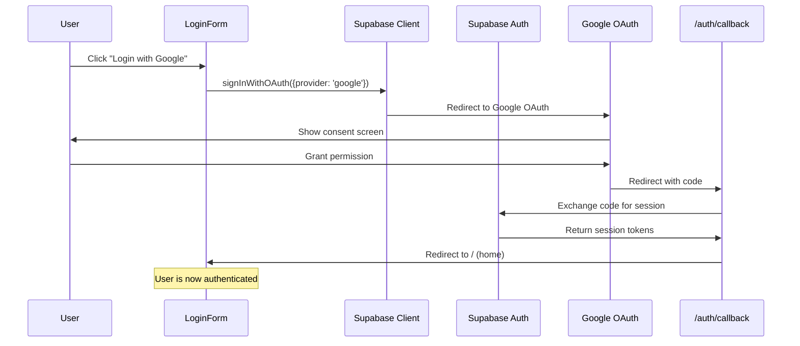

**Files involved:**
- `components/login-form.tsx` - UI component
- `app/auth/callback/route.ts` - OAuth callback handler
- `lib/supabase/client.ts` - Supabase client

### 2.2 Logout

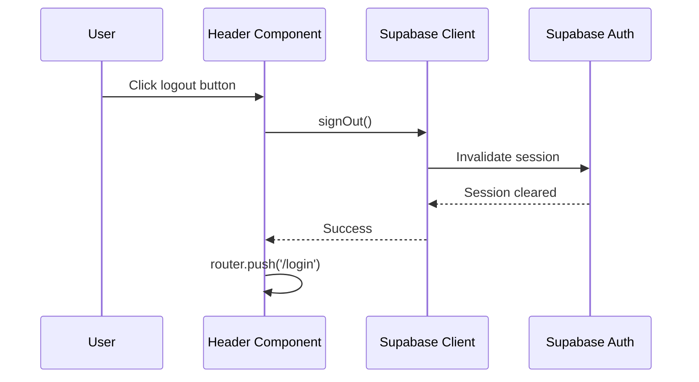

**Files involved:**
- `components/layout/Header.tsx` - Contains logout button

---

## 3. Profile/Settings Flows

### 3.1 Update Gemini API Key

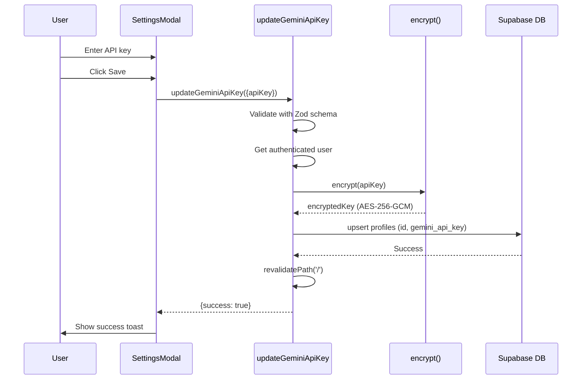

**Files involved:**
- `components/avatar-creator/SettingsModal.tsx` - UI
- `app/actions/profile-actions.ts` - `updateGeminiApiKey`
- `lib/encryption.ts` - `encrypt()`

### 3.2 Delete Gemini API Key

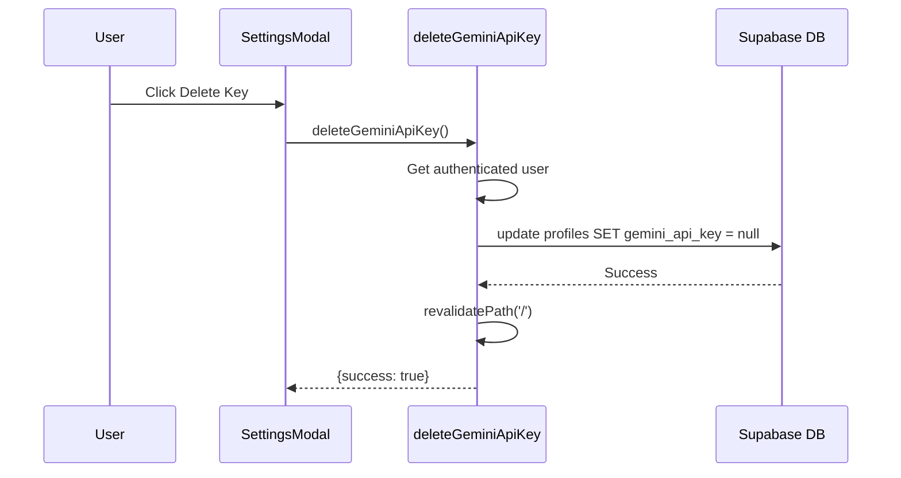

**Files involved:**
- `components/avatar-creator/SettingsModal.tsx` - UI
- `app/actions/profile-actions.ts` - `deleteGeminiApiKey`

---

## 4. Collection Management Flows

### 4.1 View All Collections

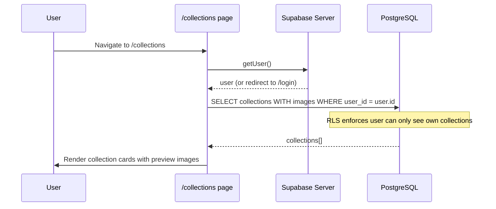

**Files involved:**
- `app/collections/page.tsx` - Server component

### 4.2 View Single Collection

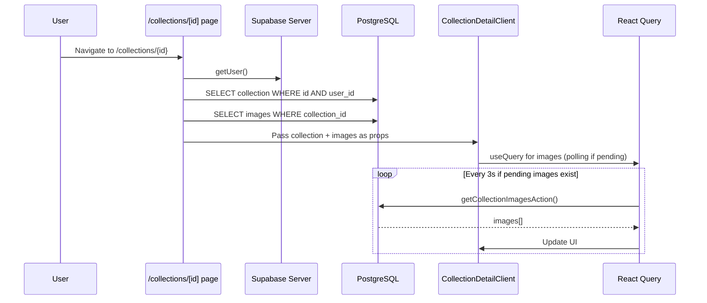

**Files involved:**
- `app/collections/[id]/page.tsx` - Server component
- `components/collections/CollectionDetailClient.tsx` - Client component
- `app/actions/image-actions.ts` - `getCollectionImagesAction`

### 4.3 Delete Collection

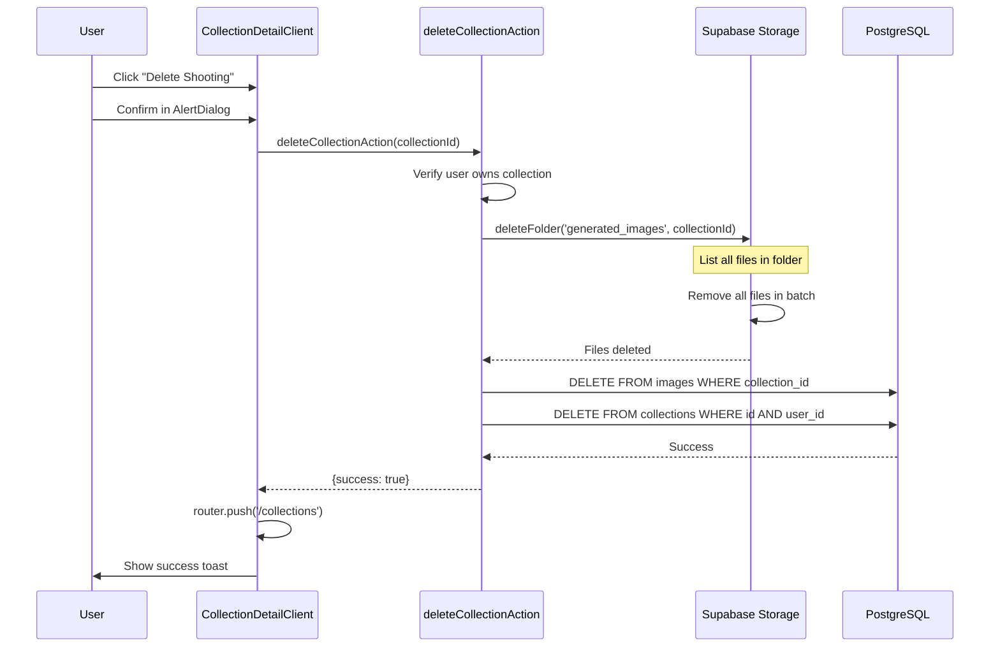

**Files involved:**
- `components/collections/CollectionDetailClient.tsx` - UI
- `app/actions/image-actions.ts` - `deleteCollectionAction`
- `lib/storage.ts` - `deleteFolder`

---

## 5. Image Generation Flows

### 5.1 Generate Images (Main Flow)

This is the most complex flow and primary candidate for trigger.dev migration.

```mermaid
sequenceDiagram
    participant U as User
    participant Panel as ConfigurationPanel
    participant Mutation as useMutation
    participant Upload as Supabase Storage
    participant Action as generateImagesAction
    participant Profile as profiles table
    participant Decrypt as decrypt()
    participant GFiles as Gemini Files API
    participant DB as PostgreSQL
    participant Refine as refinePrompt()

    U->>Panel: Configure settings
    U->>Panel: Upload reference images (optional)
    U->>Panel: Click "Generate"

    Panel->>Mutation: runGeneration(config)

    rect rgb(40, 40, 60)
        Note over Mutation: Client-side: Upload reference images
        loop For each local file
            Mutation->>Upload: upload to uploaded_images/{userId}/{sessionId}/
            Upload-->>Mutation: storage path
        end
    end

    Mutation->>Action: generateImagesAction(config)

    rect rgb(60, 40, 40)
        Note over Action: Server Action
        Action->>Action: Validate config with Zod
        Action->>Action: Get authenticated user
        Action->>Profile: SELECT gemini_api_key WHERE id = user.id
        Profile-->>Action: encrypted API key
        Action->>Decrypt: decrypt(encryptedKey)
        Decrypt-->>Action: plaintext API key
    end

    rect rgb(40, 60, 40)
        Note over Action: Transfer reference images to Gemini
        loop For each reference image path
            Action->>Upload: Download from uploaded_images
            Upload-->>Action: Blob data
            Action->>GFiles: files.upload(blob)
            GFiles-->>Action: Gemini file URI
            Action->>Upload: Remove from uploaded_images (cleanup)
        end
    end

    rect rgb(60, 60, 40)
        Note over Action: Create/Update Collection
        alt New collection
            Action->>DB: INSERT INTO collections
        else Existing collection
            Action->>DB: UPDATE collections SET status = 'processing'
        end
        DB-->>Action: collection record
    end

    rect rgb(40, 40, 80)
        Note over Action: Phase 1: Create records & refine prompts (parallel)
        par For each image to generate
            Action->>Action: selectPose(shotType, index)
            Action->>Refine: refinePrompt(client, config, pose)
            Note over Refine: Gemini API call to enhance prompt
            Refine-->>Action: finalPrompt
            Action->>DB: INSERT INTO images (status: 'pending')
            DB-->>Action: image record with ID
        end
    end

    Action-->>Mutation: {success, collectionId, imageIds}
    Mutation->>Panel: Navigate to /collections/{id}
```

**Files involved:**
- `components/avatar-creator/ConfigurationPanel.tsx` - UI and client upload
- `app/actions/image-actions.ts` - `generateImagesAction`
- `lib/image-generation.ts` - `refinePrompt`, `selectPose`, `validateImageGenerationConfig`
- `lib/encryption.ts` - `decrypt`
- `lib/poses.ts` - Pose definitions

### 5.2 Trigger Single Image Generation

This runs for each pending image after the main flow completes.

```mermaid
sequenceDiagram
    participant Client as CollectionDetailClient
    participant RQ as React Query
    participant Action as triggerImageGenerationAction
    participant Task as generateImageTask
    participant DB as PostgreSQL
    participant Profile as profiles table
    participant GFiles as Gemini Files API
    participant Gemini as Gemini API
    participant Storage as Supabase Storage

    Note over Client: useEffect watches for pending images
    Client->>RQ: Detect pending image
    Client->>Action: triggerImageGenerationAction(imageId)

    Action->>Action: Get authenticated user
    Action->>DB: SELECT image WHERE id

    alt Image already completed
        Action-->>Client: {success: true, status: 'completed'}
    end

    Action->>Profile: SELECT gemini_api_key
    Action->>Action: decrypt(apiKey)
    Action->>Action: Extract metadata (prompt, config)

    Action->>Task: await generateImageTask(...)

    rect rgb(80, 40, 40)
        Note over Task: Heavy async task (trigger.dev candidate)

        Task->>Task: Create Supabase client with session
        Task->>DB: Verify image access (RLS check)

        rect rgb(60, 60, 40)
            Note over Task: Prepare reference images
            loop For each Gemini URI in config
                Task->>GFiles: files.get(resourceName)
                loop While status = PROCESSING
                    Task->>Task: Wait 2s
                    Task->>GFiles: files.get(resourceName)
                end
                GFiles-->>Task: File ready (ACTIVE)
            end
        end

        rect rgb(40, 60, 60)
            Note over Task: Generate image
            Task->>Gemini: models.generateContent({parts, config})
            Note over Gemini: Model: gemini-2.5-flash-image
            Gemini-->>Task: Response with inlineData (base64)
        end

        rect rgb(60, 40, 60)
            Note over Task: Upload result
            Task->>Task: Decode base64 to buffer
            Task->>Storage: upload to generated_images/{collectionId}/{uuid}.png
            Storage-->>Task: Storage path
            Task->>Storage: getPublicUrl(path)
            Storage-->>Task: Public URL
        end

        Task->>DB: UPDATE images SET status='completed', url, storage_path

        rect rgb(40, 40, 60)
            Note over Task: Cleanup Gemini files
            Task->>DB: SELECT pending/failed images metadata
            loop For each uploaded file
                alt File not needed by other tasks
                    Task->>GFiles: files.delete(name)
                end
            end
        end
    end

    Task-->>Action: Complete
    Action-->>Client: {success: true}

    Note over Client: React Query refetches, UI updates
```

**Files involved:**
- `components/collections/CollectionDetailClient.tsx` - Polling and trigger logic
- `app/actions/image-actions.ts` - `triggerImageGenerationAction`, `generateImageTask`

### 5.3 Retrigger Failed Image

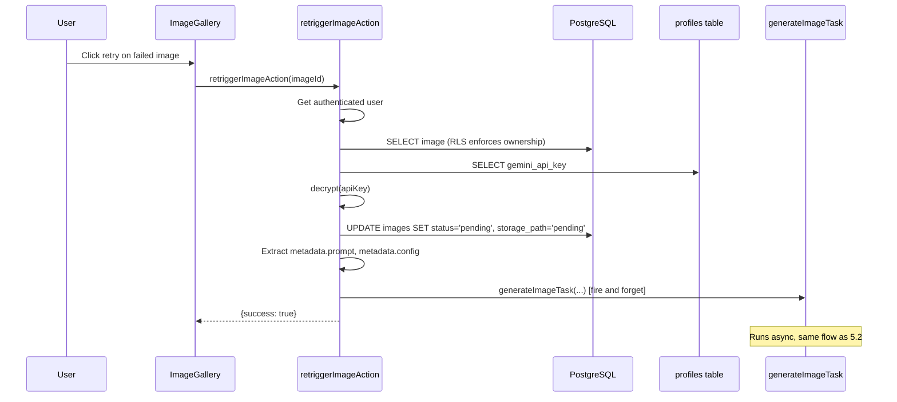

**Files involved:**
- `components/avatar-creator/ImageGallery.tsx` - Retry button
- `app/actions/image-actions.ts` - `retriggerImageAction`

---

## 6. Image Management Flows

### 6.1 Delete Single Image

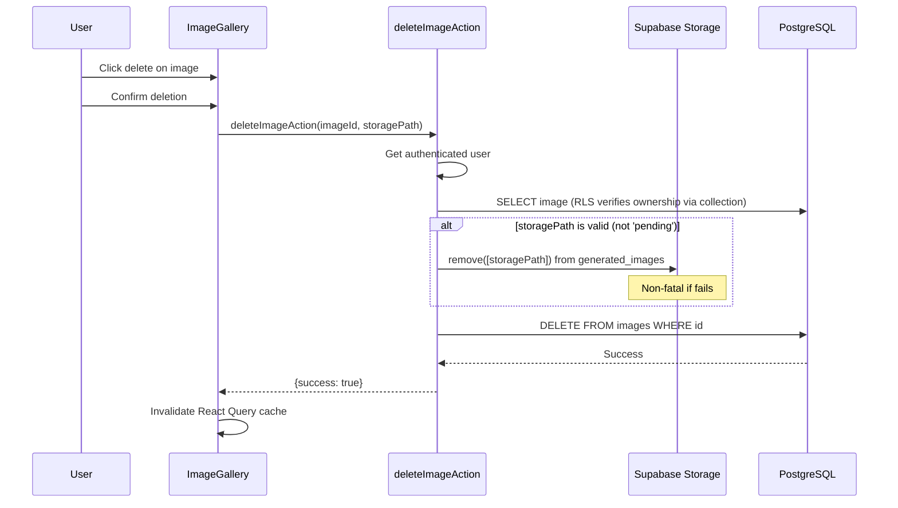

**Files involved:**
- `components/avatar-creator/ImageGallery.tsx` - Delete button
- `app/actions/image-actions.ts` - `deleteImageAction`

### 6.2 Delete All Images in Collection

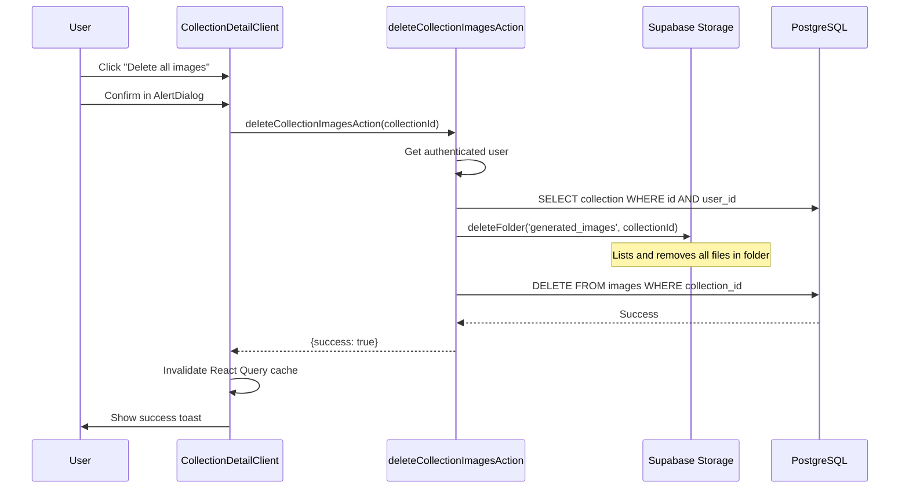

**Files involved:**
- `components/collections/CollectionDetailClient.tsx` - UI
- `app/actions/image-actions.ts` - `deleteCollectionImagesAction`
- `lib/storage.ts` - `deleteFolder`

### 6.3 Download All Images as ZIP

```mermaid
sequenceDiagram
    participant U as User
    participant Client as CollectionDetailClient
    participant JSZip as JSZip Library
    participant Storage as Image URLs (public)

    U->>Client: Click "Download All"
    Client->>Client: setIsDownloading(true)

    rect rgb(40, 60, 40)
        Note over Client: Client-side operation
        Client->>JSZip: Create new zip
        Client->>JSZip: Create folder(collection.name)

        par For each completed image
            Client->>Storage: fetch(image.url)
            Storage-->>Client: Blob
            Client->>JSZip: folder.file(`image-${i}.png`, blob)
        end

        Client->>JSZip: generateAsync({type: 'blob'})
        JSZip-->>Client: ZIP blob
    end

    Client->>Client: Create download link
    Client->>U: Trigger browser download
    Client->>Client: Cleanup URL object
    Client->>U: Show success toast
```

**Files involved:**
- `components/collections/CollectionDetailClient.tsx` - `handleDownloadAll`

---

## 7. Video Prompt Flows

### 7.1 Generate Video Prompt

```mermaid
sequenceDiagram
    participant U as User
    participant Panel as VideoPromptPanel
    participant Action as generateVideoPromptAction
    participant DB as PostgreSQL
    participant Profile as profiles table
    participant Storage as Supabase Storage
    participant GFiles as Gemini Files API
    participant Gemini as Gemini API

    U->>Panel: Configure camera style, film effects
    U->>Panel: Enter optional instructions
    U->>Panel: Click Generate

    Panel->>Action: generateVideoPromptAction(config)

    Action->>Action: Validate with Zod
    Action->>Action: Get authenticated user
    Action->>Profile: SELECT gemini_api_key
    Action->>Action: decrypt(apiKey)

    Action->>DB: SELECT image WITH collection.user_id
    Action->>Action: Verify ownership

    Action->>DB: INSERT INTO video_prompts (status: 'pending')
    DB-->>Action: Record with ID

    rect rgb(80, 40, 40)
        Note over Action: Heavy operation (trigger.dev candidate)

        alt Image has public URL
            Action->>Storage: fetch(image.url)
        else Image in storage
            Action->>Storage: download(image.storage_path)
        end
        Storage-->>Action: Image blob

        Action->>GFiles: files.upload(blob)
        GFiles-->>Action: Gemini file URI

        loop While file status = PROCESSING
            Action->>GFiles: files.get(resourceName)
            Action->>Action: Wait 2s
        end

        Action->>Gemini: models.generateContent({
            model: 'gemini-2.5-flash',
            systemInstruction: VIDEO_PROMPT_SYSTEM_PROMPT,
            parts: [fileData, userMessage]
        })
        Gemini-->>Action: Generated prompt text

        Action->>GFiles: files.delete(resourceName)
    end

    Action->>DB: UPDATE video_prompts SET status='completed', prompt_text

    Action-->>Panel: {success, videoPromptId, promptText}
    Panel->>U: Display generated prompt
```

**Files involved:**
- `components/avatar-creator/VideoPromptPanel.tsx` - UI
- `components/avatar-creator/VideoPromptConfig.tsx` - Configuration form
- `app/actions/video-prompt-actions.ts` - `generateVideoPromptAction`
- `lib/video-prompts.ts` - `VIDEO_PROMPT_SYSTEM_PROMPT`

### 7.2 Get AI Suggestions for Video Actions

```mermaid
sequenceDiagram
    participant UI as ActionSuggestions
    participant Action as getAISuggestionsForImageAction
    participant DB as PostgreSQL
    participant Profile as profiles table
    participant Storage as Supabase Storage
    participant GFiles as Gemini Files API
    participant Gemini as Gemini API

    UI->>Action: getAISuggestionsForImageAction(imageId)

    Action->>Action: Get authenticated user
    Action->>Profile: SELECT gemini_api_key

    alt No API key
        Action-->>UI: [] (empty array)
    end

    Action->>Action: decrypt(apiKey)
    Action->>DB: SELECT image WITH collection.user_id
    Action->>Action: Verify ownership

    rect rgb(60, 60, 40)
        Note over Action: Medium operation

        Action->>Storage: Fetch image (URL or download)
        Storage-->>Action: Image blob

        Action->>GFiles: files.upload(blob)
        GFiles-->>Action: Gemini file URI

        loop While processing
            Action->>GFiles: files.get()
            Action->>Action: Wait 2s
        end

        Action->>Gemini: models.generateContent({
            systemInstruction: "Analyze image, return JSON array of 3-5 German action suggestions",
            parts: [fileData, prompt]
        })
        Gemini-->>Action: JSON response

        Action->>GFiles: files.delete()
    end

    Action->>Action: Parse JSON array from response
    Action-->>UI: ["nach links schauen", "Augen schließen", ...]

    UI->>UI: Display as clickable suggestion chips
```

**Files involved:**
- `components/avatar-creator/ActionSuggestions.tsx` - UI
- `app/actions/video-prompt-actions.ts` - `getAISuggestionsForImageAction`

### 7.3 Get Video Prompts for Image

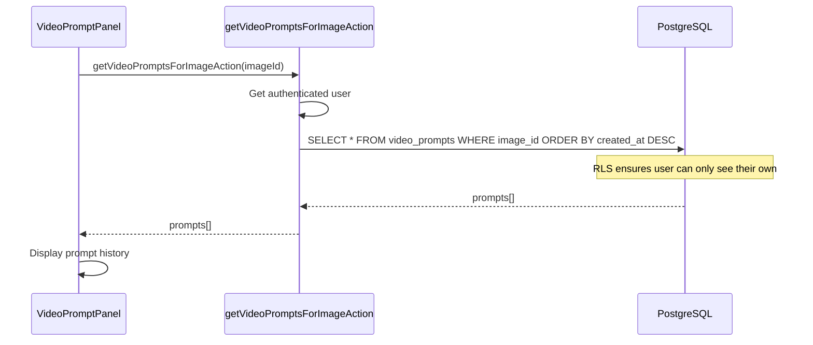

**Files involved:**
- `components/avatar-creator/VideoPromptPanel.tsx` - UI
- `app/actions/video-prompt-actions.ts` - `getVideoPromptsForImageAction`

---

## 8. Trigger.dev Migration Notes

### Primary Candidates (Heavy Operations)

These operations involve multiple API calls, file transfers, and long-running tasks:

| Action | Current Duration | Bottleneck | Priority |
|--------|-----------------|------------|----------|
| `generateImageTask` | 10-60s per image | Gemini generation | **High** |
| `generateVideoPromptAction` | 5-20s | Gemini file processing + generation | **High** |
| `getAISuggestionsForImageAction` | 5-15s | Gemini file processing + generation | Medium |

### Recommended Migration Strategy

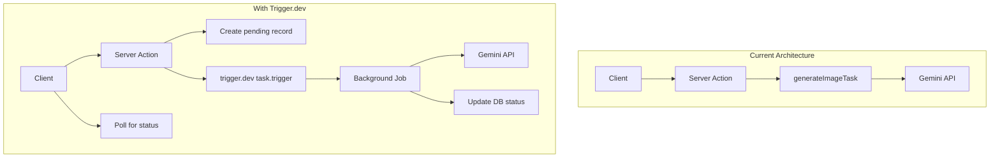

### Key Changes Needed

1. **Image Generation Task**
   - Move `generateImageTask` to trigger.dev
   - Server action only creates pending records and triggers job
   - Client polls for completion (already implemented)

2. **Video Prompt Generation**
   - Move Gemini file upload + generation to trigger.dev
   - Return pending status immediately
   - Client polls `video_prompts` table for completion

3. **Session Handling**
   - Current: Passes `access_token` and `refresh_token` to background tasks
   - With trigger.dev: Use service role key or create dedicated API tokens

4. **Error Handling**
   - Current: Updates `status = 'failed'` in catch block
   - With trigger.dev: Use built-in retry mechanisms, dead letter queues

### Environment Variables for Trigger.dev

Will need to add:
- `TRIGGER_API_KEY` - Trigger.dev API key
- `TRIGGER_API_URL` - Trigger.dev API URL (if self-hosted)

Service role key already exists (`SECRET_KEY`) for background DB operations.
